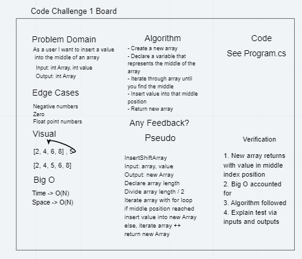

# Challenge Summary: My parter, Na'ama Bar-Ilan, and I were tasked with solving a problem through the whiteboarding process. We went thorugh each part of the technical whiteboard to find out how we were going to go about solving the problem, the we coded based off of our algorithm and pseudocode.

## The assignment for this code challenge was to solve the problem of adding a value into the middle of a given array and returning the new array, all without using built in methods to accomplish the task. We were to do so by first planning on how to code the solution by executing the whiteboarding process. We set the problem domain, Big O, algorithm, pseudocode, and other topics on the whiteboard before actually coding the solution.

## The approach we took was to first understand that in order to find the middle of the array, we had to take the length of the array + 1(to account for the fact that the first position is the "0" position, thus not a number) and divide it by 2. This got our middle and thus we set it to a variable. We then utilized a for loop with and if else statement within it. We iterated through the array, starting at 0, and checked to see if the index position we were at was the middle. If it wasn't, we added one to the iteration and continued on through the array. Once it was the middle, we would add the value, break the for loop, and return the new array. We took this approach because it seemed to be the simplest way to solve the problem without methods. If we need to check an array, you need to loop through it. If you need one of two things to happen, an if/else statement is obvious (that or a switch). We have a Big O O(N) requirement for both space and time because, while the array could be potentially massive, the computation still remains array divided by 2, then iterate through and place one value in the middle.

## Solution

# 

### Notes: Na'ama and I did reference Amanda's example later in our code challenge to help us understand how to solve the problem. We did our best not to copy her work and utilize as much of our original plan as possible, which I believe we successfully did.